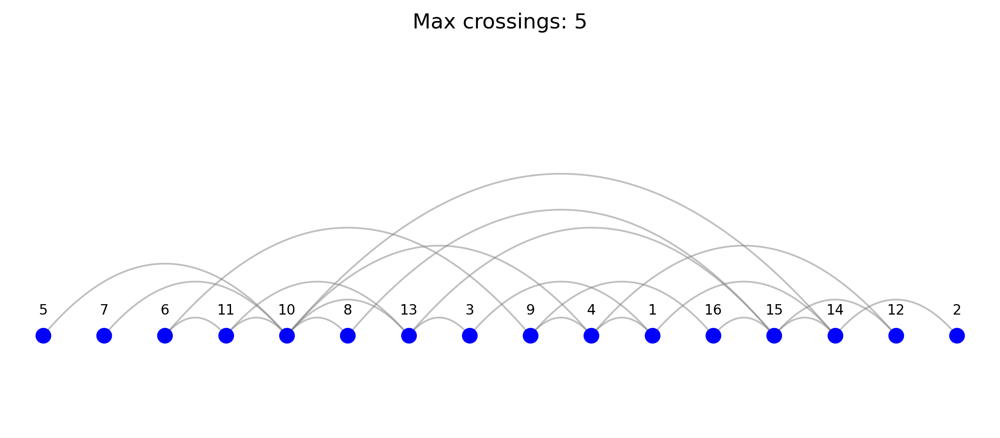

# P10: circuit design

## 🧠 The problem

I didn't tell you before, but I work pretty hard at Samsung ElectORnics.

We design and produce cutting-edge 💾 memory and logic chips.

A chip is full of components like logic gates, flip-flops and registers, functional blocks and input/output ports 🔌.

All of them are interconnected inside the chip.

Well, my job consists on improve that interconnection as much as possible to:

🕒 Reduce signal delay
⚡ Lower power comsumption
📉 Simplify wiring complexity
This helps extend the life of the chip.

I found a way to do that, though it's pretty hard when doing it by hand 🤯.

I place all the components in a linear layout, and I count how many interconnections there exist for each pair of consecutive components 🧮. It's like I draw a vertical line in every pair of consecutive components and I count how many wires cross that line.

Then I get the maximum of those, and I try to minimize that by 🔀 moving components along the linear layout.

When moving them, I need to recalculate some. I find solutions to the problem, but I think there might be a much better way to do it 🤔.

Can you help me solve this problem? 🧩

Here you can find an instance of this problem.

PS: how would you handle a different layout instead of a linear one?

Link to the [post](https://www.linkedin.com/posts/borjamenendezmoreno_operationsresearch-activity-7272155648564330498--xO4?utm_source=share&utm_medium=member_desktop)

## Analysis

**Variables**
The decision vars are integer variables that place a component i into position j.
var x {COMPONENTS} integer >= 1, <= card(COMPONENTS); # Component's position on the line

We need also auxiliary variables that count the number of crossings at position j.
I ended up with including two types of such variables - one integer with count of crossings,
and the second - binary, for each position and possible link between the components.

```Python
var c {1..card(COMPONENTS)} >= 0, <= card(COMPONENTS); # Number of crossings
var b {1..card(COMPONENTS), (i, j) in LINKS} binary; # Binary variable for crossings
```

**Constraints**

There should be a constraint to enforce different position for each component. This is a non-linear constraint, but AMPL could handle it.
It might be interesting to explore CP solvers that support a globel 'All different' constraint.

```Python
# Unique positions

subject to Unique_Positions {i in COMPONENTS, j in COMPONENTS: i < j}:
x[i] != x[j];
```

Then we need an auxiliary constraint to count the number of crossings. I ended up with using the AMPL's logical constraints feature.
This turned out to be quite clear:

```Python
# Logical conditions for crossings

subject to Crossing_Condition1 {k in 1..card(COMPONENTS), (i, j) in LINKS}:
((x[i] < k and x[j] > k)
or
(x[j] < k and x[i] > k)) ==> b[k, i, j] == 1;

# Count crossings

subject to Count_Crossings {k in 1..card(COMPONENTS)}:
c[k] = sum {(i, j) in LINKS} b[k, i, j];
```

**Objective**
The task stated that the maximum number of crossings must be minimized, but I think that the sum of crossings is a more relevant option.
The max crossings objective does not distinguish between cases, where multiple positions have the same number of crossings. It is possible in such cases to minimize the number number of positions with same number of crossings, and to reduce the number of crossings overall. The choice of the total number of crossings might lead to some positions having a very large number of crossings. In such cases we might also constrain the maximum number of crossings as well.

The solution process is quite fast. But the gap is always 100%, since the lower bound is 0.

Here's the solution for the test instance obtained within 10 minutes.

