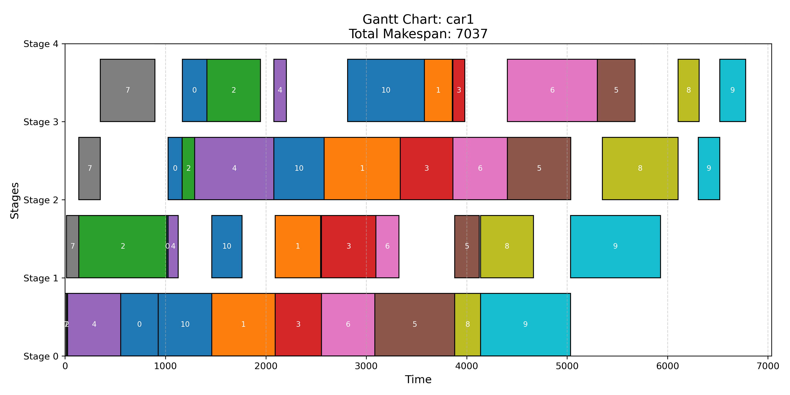

# P19: assembling

## The problem

Today I'm the Operations Manager in the manufacturing line at fORd 🚗, where every car:

Goes through painting 🎨,
Then assembly 🔩,
And finally, quality control ✅.
In the exact same order for every car.

Each car goes through multiple machines, but in the exact same order, and delays in one step can lead to bottlenecks ⚠️.

Different types of cars ⏱️ require different processing times, even though they follow the same sequence.

🎯 The goal? Minimize the total time required to complete all jobs.

Optionally, you can explore other objectives like minimizing idle time for machines 💤 or balancing workloads across machines ⚖️.

Solving this problem:

Saves time 🕑
Increases throughput 📈
Reduces machine downtime 🛑
Improves customer satisfaction 🙌
Can you help me solve this problem? 🧩

Let’s get these cars rolling smoothly! 🚙

Link to the [post](https://www.linkedin.com/posts/borjamenendezmoreno_operationsresearch-activity-7275417127174426624-9gth?utm_source=share&utm_medium=member_desktop)

## Analysis

The variables are: starting and ending times for each job and operation (real)
Also we need sequencing binary variables for each stage, and jobs x jobs
The makespan is the maximum time at the last stage, which has to be minimized

Constraints:

- ending times from starting times and durations
- no overlap constraints for jobs
- sequence of operations for each job (using start/end times)

## Results

I could solve small instances with HiGHS, but the gaps are big and convergence very slow.
Sligthly better process with AMPL's logical constraints and max as an objective function.

