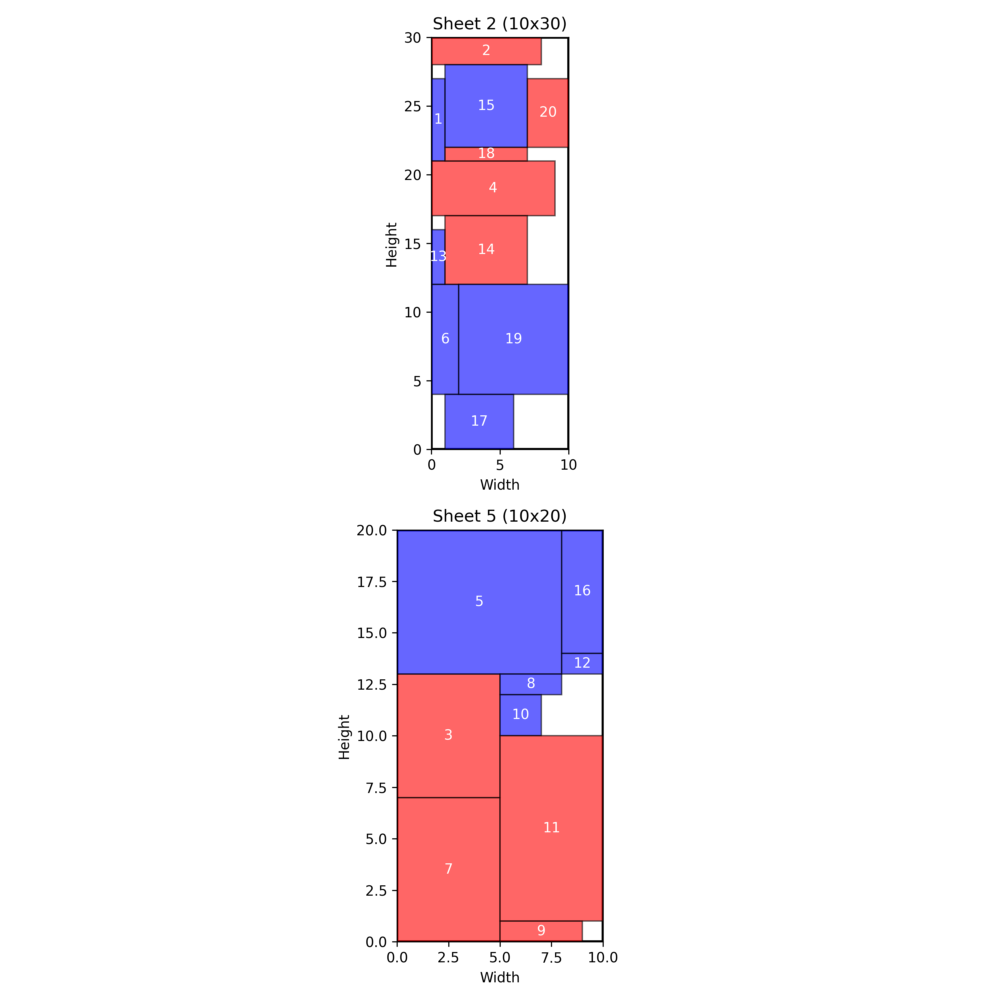

## P9: cut, cut

## 🧠 The problem

Working in FurnitORe is stressful, you know?

Every day, we receive orders requiring different-sized rectangular pieces cut from large sheets of material.

The sheets have a fixed width and height, and cutting waste directly affects our profitability.

To stay competitive, we need to pack these pieces efficiently.

Every unused area on a sheet represents wasted money, so we want to minimize that waste.

Can you help me solve this problem?

PS: how would you handle irregularly shaped items?

Link to the [post](https://www.linkedin.com/feed/update/urn:li:activity:7271793244626145281/)

## Analysis

There's an inconsistency in today's problem. Is it a cutting stock problem, or a bin packing problem?

Based on the description, it is more like cutting stock problem.

We must plan cutting 2D sheets of some material into smaller items, so that all required items are produced, and the material consumption is the lowest.

There's a MIP formulation for 2D cutting stock problem. A similar problem (Strip Packing Problem) is included in the AMPL MO Book https://ampl.com/mo-book/notebooks/03/strip-packing.html
The difference is, there's only one shelf to fit all items into, but the width of the shelf is variable.

For today's problem the decisions are:

- use a sheet (binary)
- place an item on a sheet (binary)
- coordinates of bottom left corner of the item (x1, y1) - continuous
- coordinates of top right corner (x2, y2) - continuous
- rotation of the item on when placed on a sheet (binary)

The objective is either:

- to minimize the number of the sheets used
- to minimize the total area of the sheets used

The constraints:

- An item is placed on a sheet such as it fits into the sheet's dimensions. Bottom left corner always fits, but we need a constraint for the top right corner. This is tricky, because it should be imposed only when an item is placed on a sheet. Otherwise, this constraint leads to problem infeasibility

- An item can be placed only if the sheet is used

- A constraint that links a rotation of the item to the relationship between the bottom left corner and the top right corner coordinates

- A non-overlap constraint. This is also tricky. Basically item must be to the right of the second one, or to the left of it, or to the top, or below it. But this also must be required only when both items are placed onto the same sheet.

## Results

I with some help from ChatGPT managed to write a MIP model in AMPL to solve a small instance of this problem (20 items and 6 sheets). Also I did visualization of the plan.

The 'Number of sheets used' objective is easier for the solver, but I believe that the cost is proportional to the sheet size, so the model should prefer using smaller sheets.
